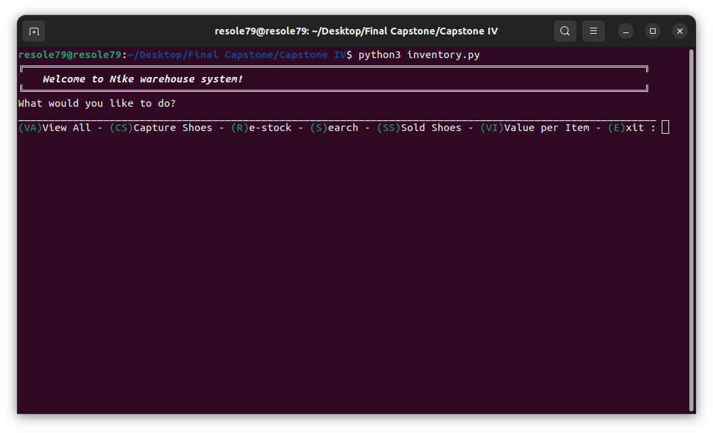
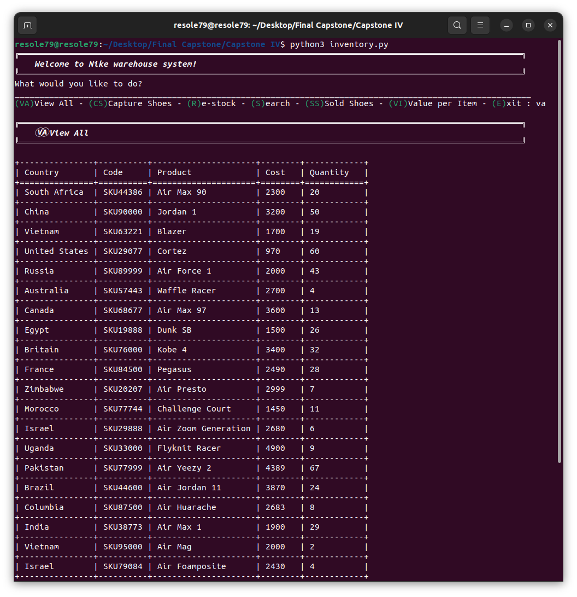
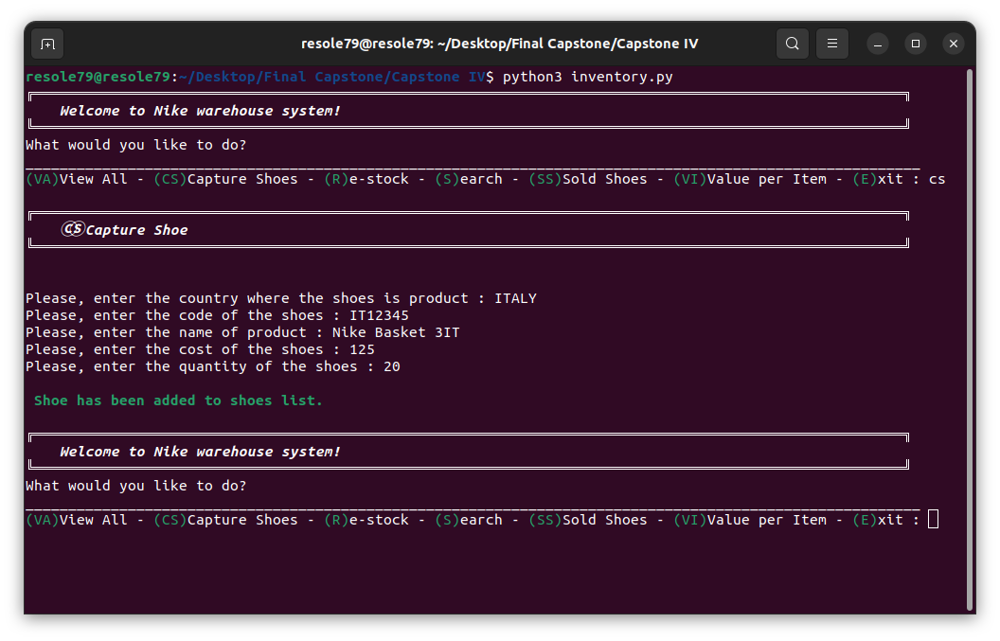
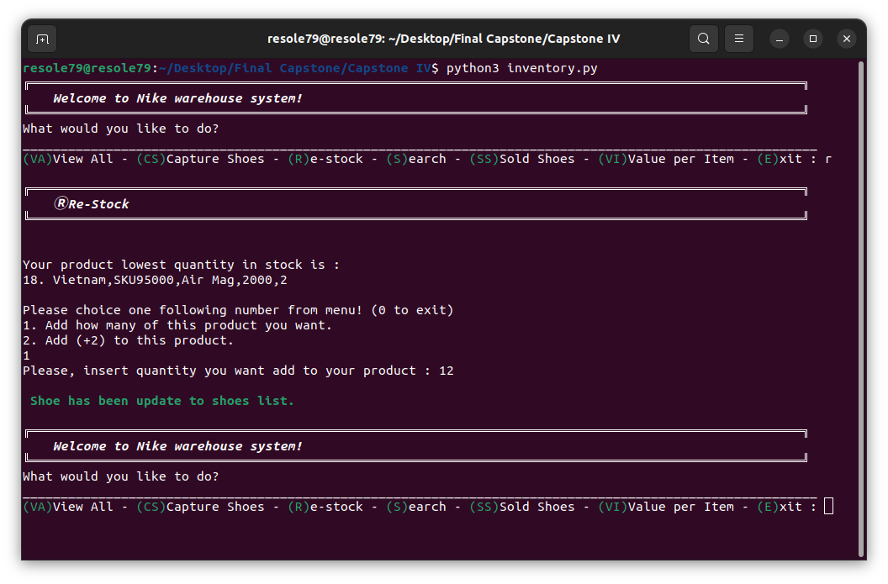
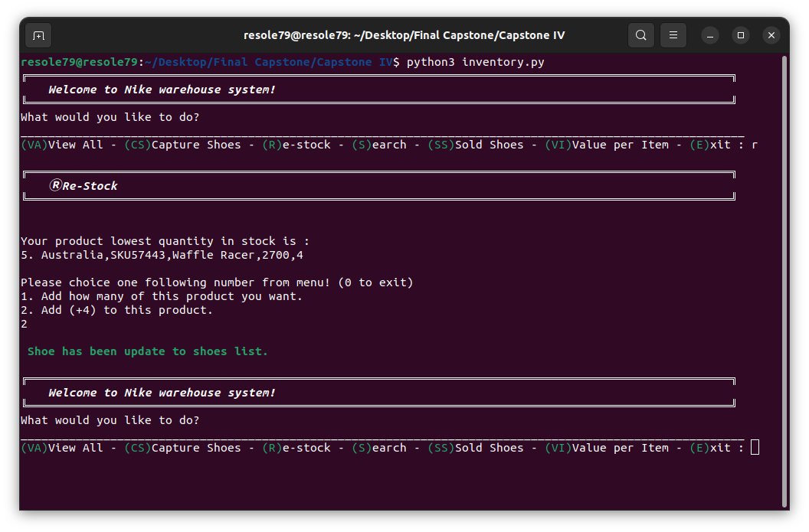
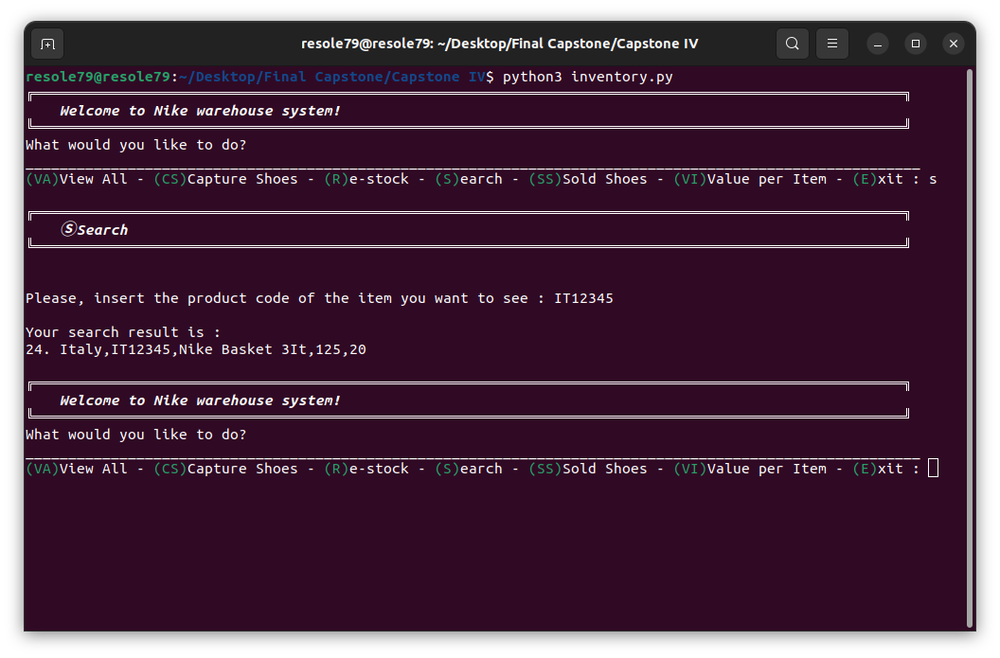
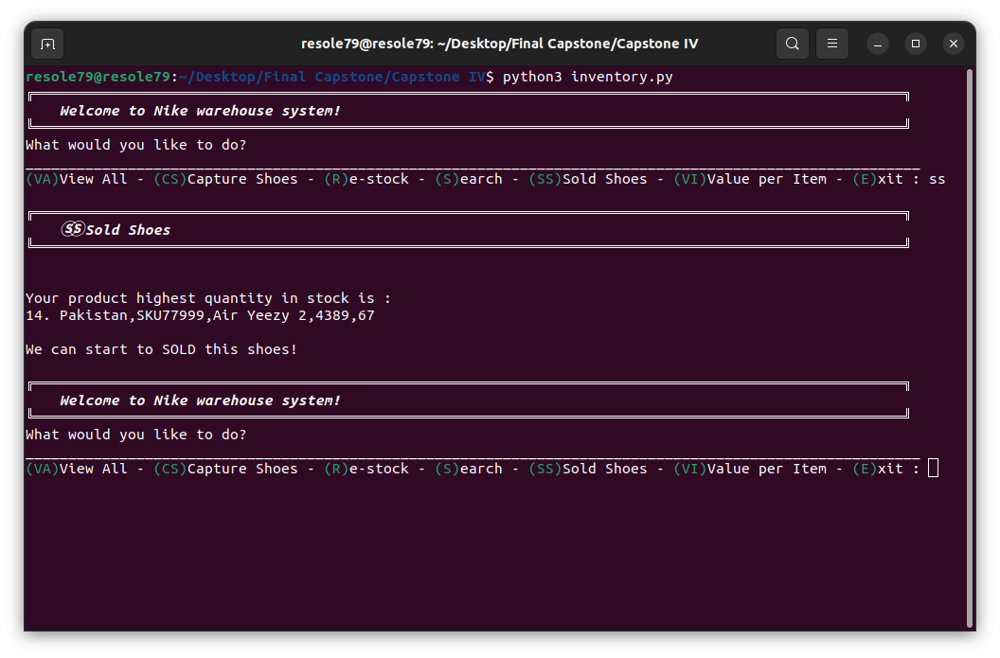
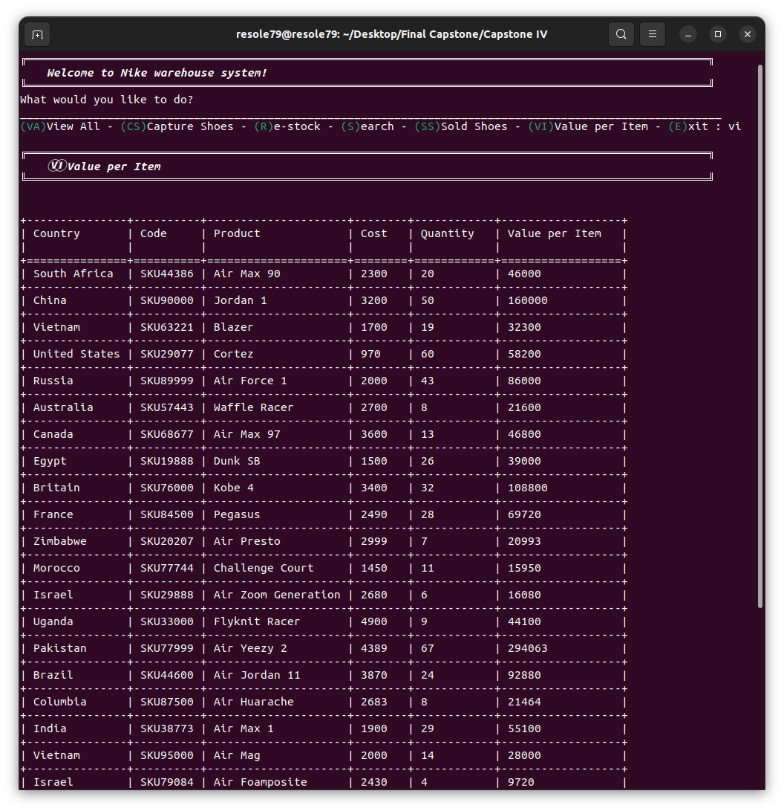

## Shoe Inventory  

Program that will read from the text file inventory.txt and
perform the following on the data: read shoes data, re-stock Shoe, seach shoe

#### Prerequisites
You will need the following software to run the Shoe Inventory :
 - [Python 3](https://www.python.org/downloads/)
 - [tabulate](https://pypi.org/project/tabulate/)

#### Installation
To get started with the Shoe Inventory , follow these steps:


1. **Install** tabulate
```sh
pip install tabulate
```

2. **Clone** the repository:

```sh
git clone https://github.com/resole79/shoe_inventory.git
```

3. **Run** the **inventory.py** file:

```sh
python inventory.py
```

#### File Structure   
 - **inventory.py**: Main program.
 - **inventory.txt**: stores a list of a shoes   
Each line includes the following data about a shoe in this order:    
country, code, product, cost, and quantity.


#### **Usage**

**How program present**

<p align="center"><br><i>menu</i></p>

**User selects *‘va’* to view all shoe in inventory**
 

<p align="center"><br><i>user selects “va”</i></p>


**User selects *‘cs’* to insert new shoe**

Ask the user to input:
 - Country where the shoes is product
 - Code of the shoes
 - Name of product
 - Cost of the shoes
 - Quantity of the shoes

<p align="center"><br><i>user selects “cs”</i></p>


**User selects *‘r’* to re-stock inventory**

The program will find the shoe object with the lowest quantity

1. Ask the user how many of this product you want to add
2. Ask the user if they want to add the same quantity

<p align="center"><br><i>user selects “r” and press 1</i></p>

<p align="center"><br><i>user selects “r” and press 2</i></p>


**User selects *‘s’* to search a shoe**

Ask the user to input:
 - Product code of the item    

<p align="center"><br><i>user selects “s”</i></p>


**User selects *‘ss’* to sold a shoe**   

The program will find the shoe object with the highest quantity 

<p align="center"><br><i>user selects “ss”</i></p>


**User selects *‘vi’* calculate the total value for each item**   

The program will calculate the total value for each item

<p align="center"><br><i>user selects “vi”</i></p>


## **Credit**

Author : Emilio Reforgiato (resole79)

##
<p align="right"><a href="https://www.linkedin.com/in/emilio-reforgiato/" target=”_blank” ></a></p>

